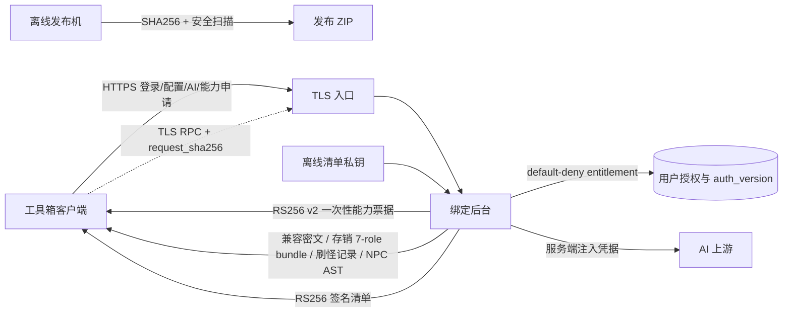

# 虾米工具箱联合安全加固与发布门禁

## 结论

离线桌面程序无法做到“不可反编译”。本方案的目标不是承诺绝对防逆向，而是把可直接造成损失的秘密、授权决策、可撤销的核心计算和更新控制权移出客户端；即使客户端被解包，攻击者也拿不到后台私钥和 AI key，不能伪造受信任更新，也不能仅靠解包直接取得已迁移的服务端实现。服务调用仍受授权、撤销、限流和审计约束。

本文位于客户端仓库。能力签发、授权校验、`micro.pak.encrypt`、存销模板、刷怪解析和 NPC AST RPC、审计及配额的实际后台实现属于另一仓库：`D:\AI程序编辑\RJDM\服务器控制后台_绑定\服务器控制后台_绑定.py`；两端必须按同一协议和发布顺序联合验收。



## 已落地

- 客户端内置不可由本地配置替换的 RSA 公钥，更新清单默认必须通过 RS256 验签。
- 签名覆盖版本、最低支持版本、下载地址、SHA256、包体积、发布时间和过期时间；篡改、过期、降级、体积不符或 HTTP 跳转都会拒绝。
- 后台默认从 `secrets/manifest-signing-2026-07.pem` 读取私钥；签名失败或包体积无效时返回 503，不回退到无签名清单。
- 后台不再默认向客户端下发 AI key，编辑器改走认证代理；上游模型和凭据由服务端控制。普通会员默认无 AI 代理权限，管理员在用户列表逐个授权。
- 密码使用 PBKDF2-HMAC-SHA256；旧 SHA256 登录成功后自动迁移。默认管理员密码会被随机引导密码替换。
- 会话具备空闲/绝对超时、授权版本失效和撤销；登录、AI 代理、请求体与响应体均有限流或大小限制。
- `micro.pak.encrypt` 的兼容编码实现已从客户端移到 TLS RPC。客户端通过 `/api/v2/capabilities` 申请 v2 能力票据，再调用 `/api/v2/rpc/micro-pak/encrypt`；本地不再保留该编码算法。
- v2 票据使用独立签名上下文并绑定 `purpose=rpc`、RPC 路径、规范化请求的 `request_sha256`、feature、client version、session、device hash、nonce 和 `auth_version`；票据短时有效且 `jti` 在当前单进程后台内原子单次消费，重放默认拒绝。
- `micro.pak.encrypt` 权限采用 default-deny entitlement。服务端在执行前同时验证登录会话、设备、授权版本、请求绑定和票据状态；撤销授权或递增 `auth_version` 会使旧会话/票据失效。
- 核心 RPC 已限制单次请求体、批次数量、单项字符数和 GBK 字节数，并在当前单进程后台内按账号聚合限制请求、条目、字节、日用量和并发数，切换设备或来源 IP 不会重置额度。审计只记录服务端请求 ID、HMAC 脱敏后的账号/设备/来源、请求摘要、HMAC 化 operation 标识、结果码和计量信息，不写入密码明文、兼容密文、原始 IP、票据或会话令牌；成功结果在审计持久化失败时返回 503，不向客户端泄露密文结果。
- 客户端批量调用保留原文件的路径改写、GBK/CRLF 和尾换行语义；RPC 或授权失败时事务回滚并 fail closed，不静默切回本地算法。
- 微端 PAK 核心 RPC 在 Qt 工作线程执行，提供进度、取消和防重复提交；只有远端结果完整返回且源 PAK 快照未变更后才开始本地文件事务。
- `store.settings`、`spawn.visual.edit` 和 `npc.visual.parse` 已改为独立的 v2 request-bound RPC。存销 `/api/v2/rpc/store/render-bundle` 严格返回四个最终 feature 脚本和 `owned.qmanage_login`、`owned.qmanage_timer`、`owned.qfunction_main` 共七个 role；每项绑定固定 role/name 与正文 SHA256，identity 的 `config_sha256` 绑定 feature/category/script/method/common/zone/U 变量、传送条件、Timer、QR、资源编号和提示文本等完整配置。刷怪返回零基行号、原始字段和字符 token span；NPC 返回有深度、节点数和 source span 上限的 JSON AST。客户端对 operation ID、schema、core version、role 顺序、固定文件名、正文 hash 和完整配置 identity 再次严格校验。
- 三项迁移后的客户端职责仅包括读取本地文件、展开本地 `#CALL` 输入、role 到安全相对文件名映射、通用 owned-marker 合并、重建显示模型、布局/素材预览、encoding/newline 保持和事务写回。客户端不再保存 Store 四模板、QManage/QFunction owned block 或其 replace/normalize/Timer patch；RPC、授权、hash 或 AST 校验失败时 fail closed，不使用本地完整核心兜底。
- 后台已停止为 NPC、刷怪和存销签发 native lease；客户端 native core 同步移除三项 dispatch，仅保留免费微端计次路径。生产 PyInstaller 明确排除 NPC 完整 parser，并不再将 `咕咕鸡过滤.txt` 加入发布资源 allowlist；Store bundle 规则只存在于后台 `native_store_rules.py`。
- 可视化 NPC 的 PAK/WIL/WZL 素材采用 hybrid 文件快照授权：资源文件始终留在本机，客户端只向后台提交规范化路径 SHA256、安全文件名、后缀、文件 SHA256、大小、magic、用途、索引语义和密码 SHA256；后台不接收绝对路径、密码明文或素材字节。后台为 `npc.asset.decode/authorize-read` 签发单次 native lease，并按 `npc.visual.parse` entitlement、设备、operation、scope、计次、防重放和审计执行 default-deny。
- native worker 使用 `CreateFileW` 打开普通磁盘文件，拒绝目录和 reparse point，流式复核文件 SHA256、大小、magic、后缀、用途与密码绑定，消费 lease 后才返回一次性授权回执和加密规则中的 resolved password、header password、prefix/data-base、index modes 与 format version。NPC provider 必须把该 profile 传入 decoder；PAK 单文件及 WIL/WIX、WZL/WZX 配对文件集合均做精确路径绑定，授权失败不得进入 decoder 或槽位探测兜底。
- “一次使用”的发布口径是每个账号/设备/用途/密码对应的本地文件快照申请并消费一次 lease；同一解析会话内只复用不含密钥的授权回执和内存解码结果。缓存绑定 session token 摘要与首/中/尾采样指纹，文件快照、账号、设备或 token 变化会重新授权并清理页面、provider 与 native gate 缓存；并发相同请求使用 single-flight，避免重复消耗 lease。
- PyInstaller 将内嵌 Python 模块收入 PYZ；当前发布扫描覆盖发布目录和 ZIP 中可枚举的 loose 文件，拒绝裸 `.py/.pyc`、私钥、账号、令牌、日志、数据库和未审批脚本。PYZ 内部扫描边界见“剩余风险”。
- 资源与微端模板使用精确 SHA256 allowlist；旧 `PasswordWorker.ps1` 已退役并列入发布禁入项，免费微端敏感逻辑只由原生核心执行。
- Git 忽略运行时账号、插件配置、构建产物、发布包和 `secrets/`，防止误提交。

## 强制发布顺序

1. 立即撤销并重建历史包或本机运行配置中出现过的 AI key、NapCat WebUI token 和其他凭据；旧 `dist` 与旧 ZIP 不再分发。
2. 先部署同时支持新 RPC 和现有线上客户端的后台版本，完成灰度 RPC 验收；再发布已切换存销/刷怪/NPC RPC 的客户端；确认活跃版本达到门槛后，最后停发三项旧 native lease。若选择一次性封旧 lease，后台与新客户端必须在同一维护窗口切换，避免旧客户端功能中断。
3. 对生产用户数据先 dry-run 并记录摘要；真正写入前必须停止后台、只为一个普通灰度账号执行 `python scripts/migrate_toolbox_features.py --data-dir <runtime-data> --username <gray-user> --apply --confirm-service-stopped`，再校验自动备份和前后 SHA256 后启动服务。不得在后台运行期间迁移，不得把管理员身份当作普通会员授权验收替代品。
4. 生产登录、能力申请和核心 RPC 已切到 TLS，客户端已使用固定信任根建立后端连接。每次发布仍须验证证书有效期、主机/端口、固定信任根和防火墙范围；不得回退公网 HTTP，也不得开放后台管理监听。
5. 用真实客户端完成一次双仓库灰度：授权账号成功、未授权账号 403、重放 409、撤权后旧票据失效、审计无敏感正文；再按 10% / 25% / 100% 放量。
6. 在后台部署新的清单私钥，只授予运行账号、SYSTEM 和 Administrators 读取权限。私钥不得复制到客户端仓库或发布目录；强制签名默认开启，私钥缺失时接口保持 503。
7. 配置真实 `download_url`、`sha256`、`size`、`min_supported_version` 和清单有效期，再生成签名清单。
8. 在干净目录完成 PyInstaller 构建，执行发布目录与 ZIP 双重扫描、核心 RPC smoke、打包版 smoke、SHA256 和体积检查。
9. 使用受信任的 Windows Code Signing 证书同时签名主 EXE 与 `native/xiami_native_core.exe` 并验证 Authenticode，再上传 ZIP 和启用更新清单。

## 私钥轮换

在后台项目目录用 PowerShell 7 执行：

```powershell
.\scripts\generate_manifest_signing_key.ps1 `
  -OutputPath .\secrets\manifest-signing-YYYY-MM.pem `
  -Bits 3072
```

脚本拒绝覆盖现有私钥。轮换时先把新公钥和新 `key_id` 加入客户端并发布过渡版本，再让后台切换新私钥；确认旧客户端淘汰后再移除旧公钥。

## 发布命令与门禁

```powershell
.\scripts\build.ps1 -ValidateOnly
.\scripts\package.ps1 -CoreRpcGateOnly
pwsh.exe -NoProfile -NonInteractive -File .\scripts\finalize_production_release.ps1 `
  -DownloadUrl 'https://download.example.com/虾米工具箱-1.4.0.zip' `
  -PreviousReleaseZip '.\虾米工具箱-1.3.8.zip' `
  -CertificateThumbprint '<code-signing-certificate-thumbprint>' `
  -ArchiveExistingUnsigned
```

生产收口入口是 `scripts/finalize_production_release.ps1`。它先完成证书、HTTPS 下载地址、HTTPS 时间戳、上一版 ZIP 和同版本产物冲突预检；预检全过后才归档现有 unsigned 三件套并完整重建。`-PreflightOnly` 只检查，不移动或重建任何文件。证书也可通过 `-PfxPath` 提供，PFX 密码只从当前进程的 `XIAMI_AUTHENTICODE_PFX_PASSWORD` 读取。

底层签名脚本为 `scripts/sign_authenticode.ps1`，固定使用 SHA256。生产发布必须提供 HTTPS 时间戳；主 EXE 与 native core 必须都是 `Valid`、都有时间戳并由同一证书签名。`scripts/verify_release_zip_binaries.ps1` 会流式核对 ZIP 内两枚 EXE 与 `dist` 的 SHA256，禁止使用“已签名 dist + 旧 unsigned ZIP”生成可发布元数据。

`build_update_temp.ps1` 在构建或复用现有包之前强制运行 Core RPC protocol、异步生命周期、客户端 fail-closed 行为和相邻后台真实 TLS integration probes；相邻后台、probe、OpenSSL 或任一验收缺失都会中止发布。`-CoreRpcGateOnly` 用于不执行 PyInstaller/截图 smoke 的轻量门禁复验。

`publish_ready` 只会在打包 smoke 通过、ZIP 二进制绑定通过、主 EXE 与 native core 签名有效且都有时间戳、两者 signer 相同，并且下载地址为无内嵌凭据的 HTTPS URL 时为 `true`。`finalize_production_release.ps1` 会强制设置 `XIAMI_RELEASE_REQUIRE_AUTHENTICODE=1`；任一条件不满足都会直接失败。项目当前没有可用的代码签名证书，因此正式发布仍处于阻断状态。

## 回滚边界

- 后台可回滚程序版本，但不得回滚到下发 AI key、默认管理员密码或无签名更新的版本。
- 核心 RPC 回滚必须保持 default-deny、请求绑定和票据单次消费；服务异常时客户端 fail closed，不得临时恢复本地核心编码、NPC/刷怪 parser、存销模板或签发不绑定请求的通用票据。
- `XIAMI_LEGACY_EXPOSE_EDITOR_AI_KEY=1` 仅用于短时旧编辑器救援；启用会在后台输出高危告警，正常发布必须关闭。
- 若签名服务异常，保持更新接口 503；不要临时关闭客户端验签。
- 发布失败时恢复上一份已签名、已扫描、SHA256 已记录的完整包，不从旧 `dist` 临时拼包。

## 剩余风险

- PYZ、PowerShell 封装和混淆只能提高分析成本，不能保护仍在本地执行的逻辑。`micro.pak.encrypt` 移到后台后可撤权、限流和审计，但兼容编码本身仍不是秘密：授权用户控制明文并观察密文，可以把接口当作 oracle 采样并推断算法。
- 高价值逻辑不能只搬成“任意输入 -> 任意输出”的远程算法接口。应把完整业务操作放到后台，严格收窄输入域，由服务端读取可信状态并只返回最终业务产物；必要时给产物加入账号、版本、时效或用途绑定。
- NPC 素材的完整 Python codec 仍在客户端，这正是当前选定 hybrid 方案与“服务端完整解码”方案的边界。native lease 能让官方调用链可撤销、可计次、可审计并提高直接复用成本，但不能阻止攻击者修改 Python、伪造本地 marker、hook 已授权进程或提取本地算法。发布说明不得宣称 PAK 解码核心已经完全移出客户端。
- PAK lazy record 会在后续像素解码时按路径重新打开文件；缓存命中用首/中/尾采样指纹控制性能，真正的新解码完成后再做完整 SHA256。未采样区域的定点修改和极窄的 reopen 竞态仍属于已接受残余风险；若以后要求抵抗这种本地对抗，必须升级为 native-only 持句柄解码或服务端解码，而不是继续堆 Python 标记。
- NPC 页面一次渲染可能产生多个不同源码快照的 RPC。客户端仅缓存最近的相同源码 AST；后台必须按 feature 设置适合交互编辑的账号级速率和并发上限，不能复用过低的微端批处理阈值，也不能取消工作量控制。
- TLS 和固定信任根保护传输与服务端身份，不能阻止已授权客户端被调试、hook、抓取入参/结果或自动化调用。device hash 也不是硬件证明，仍需和 entitlement、短时票据、配额、异常检测及撤权一起使用。
- 请求、条目、字节、日用量和并发配额只能压低单账号滥用；分布式账号、账号共享和后台主机失陷仍需通过告警、封禁、密钥隔离、最小权限和服务器补丁管理控制。
- 当前 RPC grant、单次消费记录、分钟/日配额和并发计数都保存在进程内存，生产灰度只支持单后台进程；进程重启会重置计数，多实例会造成签发与消费不共享。启用多实例或滚动部署前必须迁移到 Redis/数据库等原子共享存储。
- 服务端当前用“本进程签发记录 + 完整 envelope/claims 摘要匹配”消费 RPC 票据，单进程下可拒绝外部篡改；在共享 grant 或多实例之前，还必须加入 active/retiring 公钥 ring 的独立 RS256 验签和轮换窗口。
- 当前发布扫描不解包 PyInstaller PYZ/EXE 内部归档，不能据此宣称已扫描所有内嵌 Python 内容。正式高保证发布还需增加构建前源码秘密扫描及 PyInstaller archive 解包/字符串 allow-deny 门禁。
- Authenticode 证书尚未配置；签名清单保护更新来源，代码签名用于保护发布者身份和落地文件完整性，两者不能互相替代。
- 微端模板 `UpdateServer.ini` 含公开的初始密码占位值，完整文件受 SHA256 allowlist 约束；它随客户端交付，不能当作生产秘密。实际部署必须为每套微端改用独立值并限制网关来源。
